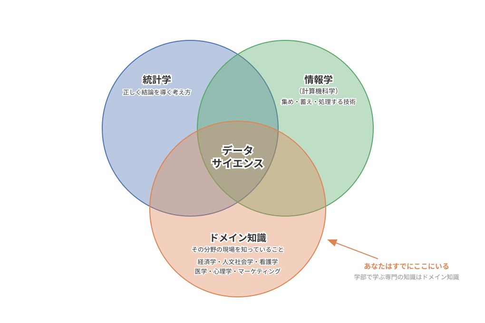
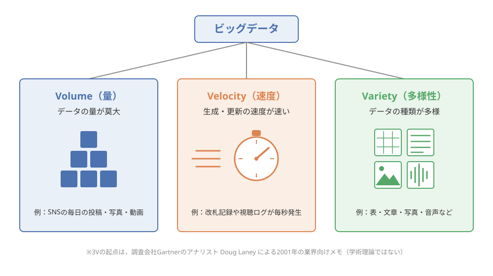
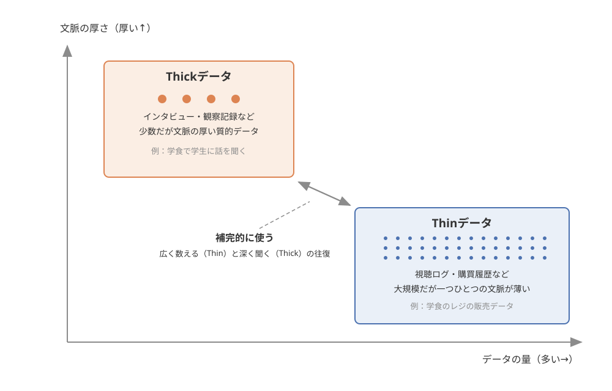
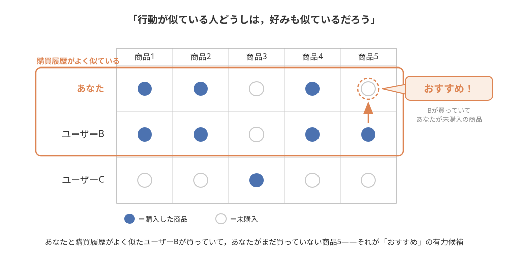
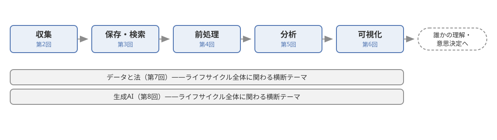

データサイエンス・リテラシー

第1回  
データサイエンスとは何か  
——ビッグデータと  
Thick・Thinデータ

 

担当：山本祐輔

<!-- ノート：章タイトル／要点：科目「データサイエンス・リテラシー」の第1回．データサイエンスとは何かを，ビッグデータとThin・Thickデータという対比を軸に学ぶ．挨拶と科目の位置づけを一言（文系含む全学部の1年生向け） -->

---

この回で学ぶこと

- データサイエンスの定義と学際性
- データ駆動型社会とAI・データ活用事例
- ビッグデータの3Vと，その限界
- ThinデータとThickデータ——組み合わせる意義

最後に，本科目全体の地図（データのライフサイクル）を描く

<!-- ノート：「この回で学ぶこと」／要点：学習目標を4点＋地図の予告として提示．定義・学際性→駆動型社会と事例→3Vと限界→Thin/Thickの順に進むことを伝える．各用語は本編で1つずつ説明すると予告 -->

---

Part 1／このパートで扱うこと

Part 1

- 導入：「おすすめ」はなぜ私の好みを知っているのか
- データサイエンスの定義と学際性
- データ駆動型社会

<!-- ノート：導入〜データ駆動型社会（パート区切り）／要点：全3パート構成の1つ目．身近な「おすすめ」の謎から出発し，データサイエンスの定義・学際性・データ駆動型社会まで進む -->

---

導入——「おすすめ」はなぜ私の好みを知っているのか (1/4)

ある大学1年生の朝

- 動画アプリ：昨夜見ていた芸人の新作が「おすすめ」の一番上に
- 地図アプリ：「いつもより電車が遅れています」
- ショッピング：先週検索したスニーカーが「あなたへのおすすめ」に
- SNS：気になり始めたアイドルの投稿ばかり

<!-- ノート：導入「おすすめ」はなぜ私の好みを知っているのか／要点：ある大学1年生の朝の事例を語る．動画・地図・買い物・SNS，どのアプリも「先回り」してくる．学生自身の毎日と重ねてもらう -->

---

導入——「おすすめ」はなぜ私の好みを知っているのか (2/4)

なぜアプリは  
誰にも話していないはずの「好み」を  
知っているのか？

<!-- ノート：導入「おすすめ」はなぜ私の好みを知っているのか／要点：問いを立てるスライド．スニーカーが並んで「ドキッとする」感覚．アプリは心を読んでいるのか？と問いかけ，少し間を置く -->

---

導入——「おすすめ」はなぜ私の好みを知っているのか (3/4)

心を読んでいるのではなく  
蓄積された行動の記録（データ）から  
「次に好みそうなもの」を予測している

 

動画を最後まで見たか・商品を何秒眺めたか・どの駅で乗り降りしたか

<!-- ノート：導入「おすすめ」はなぜ私の好みを知っているのか／要点：種明かし．最後まで見たか，何秒眺めたか，どの駅で乗り降りしたか——行動の記録が毎日大量に蓄積され，分析されている -->

---

導入——「おすすめ」はなぜ私の好みを知っているのか (4/4)

データを「使われる側」から  
「使う側」へ

 

データと上手に，正しく付き合う基礎体力  
＝ **データサイエンス・リテラシー**

<!-- ノート：導入「おすすめ」はなぜ私の好みを知っているのか／要点：いまは毎日データを「使われる側」．社会に出れば文系・理系を問わず「使う側」に回る．専門家になる科目ではなく，基礎体力＝リテラシーを身につける科目 -->

---

データサイエンスの定義 (1/3)

**データサイエンス**とは  
データから価値のある知見を引き出す  
学問・技術の総称

<!-- ノート：データサイエンスとは何か——定義と学際性（データサイエンスの定義）／要点：一言でいえばこの定義．「価値のある知見」＝知識・洞察．次のスライドで具体例を見せる -->

---

データサイエンスの定義 (2/3)

価値のある知見＝  
判断や行動につながる発見

- 「この患者の画像には病気の兆候がありそうだ」
- 「この地域は大雨のとき浸水の被害が出やすい」
- 「この商品を好む人は次にあれを買うことが多い」

<!-- ノート：データサイエンスとは何か——定義と学際性（データサイエンスの定義）／要点：抽象的な「知見」を3つの例で具体化．医療・防災・買い物——どれも判断や行動につながる発見である点が共通 -->

---

データサイエンスの定義 (3/3)

紙と電卓の時代の統計学では  
扱えなかった規模と種類のデータを  
コンピュータの力で処理できるように

 

語の起点は2001年——統計学を計算機科学の方向へ拡張する構想から

<!-- ノート：データサイエンスとは何か——定義と学際性（データサイエンスの定義）／要点：昔からある統計学と何が違うのか．統計学者Clevelandが2001年に統計学の拡張として構想したのが歴史的起点のひとつ．統計学と計算機の結びつきに新しさがある（Dhar） -->

---

学際性——統計学×情報学×ドメイン知識 (1/4)

**学際性**——  
データサイエンスは3つの要素の掛け算

- 統計学：データから正しく結論を導くための考え方
- 情報学（計算機科学）：データを集め・蓄え・処理する技術
- ドメイン知識：分析対象となる分野そのものの専門知識

<!-- ノート：データサイエンスとは何か——定義と学際性（学際性）／要点：もうひとつの大切な特徴が学際性＝複数の学問分野にまたがる性質．統計学・情報学・ドメイン知識の3要素の掛け算でできている -->

---

学際性——統計学×情報学×ドメイン知識 (2/4)

3つの円の重なりに，データサイエンスがある

<!-- ノート：データサイエンスとは何か——定義と学際性（学際性）／要点：ベン図で3要素の重なりを確認．ドメイン知識の円の中に経済学・人文社会学・看護学など——「あなたはすでにここにいる」の注記に触れる -->

---

学際性——統計学×情報学×ドメイン知識 (3/4)

統計の計算が得意でも  
現場感覚がなければ  
数字の変化の意味を読み取れない

 

例：コンビニの売上——「雨の日は来店客が減る」「給料日の後は高めの商品が売れる」

<!-- ノート：データサイエンスとは何か——定義と学際性（学際性）／要点：ドメイン知識＝その分野の現場を知っていること．コンビニの例——現場感覚がなければ数字の意味も読めず，「何を分析すべきか」という問いすら立てられない -->

---

学際性——統計学×情報学×ドメイン知識 (4/4)

経済学も，人文社会学も，看護学も——  
すべて不可欠なドメイン知識

 

データサイエンスは，統計やプログラミングの専門家だけのものではない

データの技術×現場を知る人——組んで初めて価値が生まれる

<!-- ノート：データサイエンスとは何か——定義と学際性（学際性）／要点：文系の学生への強調ポイント．各学部で学ぶ知識はすべてドメイン知識．データの専門家と対話し協働するための共通言語がこの科目のリテラシー -->

---

データ駆動型社会 (1/2)

**データ駆動型社会**——  
勘や経験だけに頼らず  
データという証拠に基づいて判断する社会

 

背景：スマホの普及で，誰もが「データを生み出す装置」を持ち歩く時代に

<!-- ノート：データ駆動型社会——なぜいまデータサイエンスが注目されるのか（勘と経験から，データに基づく判断へ）／要点：注目される最大の理由はデータ量の爆発的増加．SNS投稿・検索履歴・電子マネー・位置情報・センサー．「駆動」＝データが社会の仕組みを動かす原動力 -->

---

データ駆動型社会 (2/2)

勘と経験を捨てるのではなく  
データで補強する

 

- ベテラン店長の勘：「そろそろおでんが売れる時期だ」
- データ駆動型：気温・曜日・過去の売上から発注量を予測し，勘を裏づけ・修正

<!-- ノート：データ駆動型社会——なぜいまデータサイエンスが注目されるのか（勘と経験から，データに基づく判断へ）／要点：コンビニの発注の例．店長の勘は貴重．データはそれを裏づけたり修正したりする．勘vs.データではなく補強の関係 -->

---

Part 1／ここまでのまとめ

- データサイエンス＝データから価値のある知見を引き出す学問・技術
- 統計学×情報学×ドメイン知識の学際性——文系の知識も不可欠
- 勘や経験をデータという証拠で補強する，データ駆動型社会へ

<!-- ノート：Part 1のまとめ（定義と学際性／データ駆動型社会）／要点：3点を短く復唱．次のパートでは，データ駆動型社会の「具体的な姿」を4つの分野の事例で見ていくと予告 -->

---

Part 2／このパートで扱うこと

Part 2

- 社会におけるAI・データ活用事例（医療・防災・マーケティング・交通）
- ビッグデータと3V
- ビッグデータの限界

<!-- ノート：データ駆動型社会〜ビッグデータと3V（パート区切り）／要点：2つ目のパート．活用事例を4分野で実感→それらを支えるビッグデータとは何か（3V）→ただし万能ではない（限界）へ進む -->

---

社会におけるAI・データ活用事例 (1/6)

データ駆動型社会の姿を  
4つの分野で実感する

- 医療：画像診断支援
- 防災：被害予測
- マーケティング：推薦システム
- 交通：需要予測

<!-- ノート：データ駆動型社会（社会におけるAI・データ活用事例）／要点：AI＝大量のデータからパターンを学習して認識や予測を行うプログラム（全体像は第10回）．ここでは4分野を1つずつ見る -->

---

社会におけるAI・データ活用事例 (2/6)——医療

医用画像から病変の疑いを  
自動で見つけてマーク——  
医師を支える「もう一組の目」

 

X線・CT・MRI．大量の画像から病変のパターンを学習（深層学習）

<!-- ノート：データ駆動型社会（社会におけるAI・データ活用事例）／要点：医療＝画像診断支援．深層学習が分野を大きく前進させ，2017年時点で300超の研究を集めたサーベイが出るほど活発．医師の見落としを防ぐ「もう一組の目」 -->

---

社会におけるAI・データ活用事例 (3/6)——防災

災害記録×気象×地形のデータで  
被害を予測し，命を守る

 

「大雨のときどの地域が浸水しやすいか」→ ハザードマップ・避難計画へ

<!-- ノート：データ駆動型社会（社会におけるAI・データ活用事例）／要点：防災＝被害予測．過去の災害記録・気象データ・地形や土地利用のデータを組み合わせ，浸水や建物被害を予測．結果はハザードマップや避難計画に活かされる -->

---

社会におけるAI・データ活用事例 (4/6)——マーケティング

閲覧・購買履歴から好みを推測し  
一人ひとりに合った「おすすめ」を提示

 

導入で見た「おすすめ」の正体＝**推薦システム**——この回の後半で詳しく

<!-- ノート：データ駆動型社会（社会におけるAI・データ活用事例）／要点：マーケティング＝推薦システム．導入の謎の正体がこれ．仕組みの中身はこの回の活用事例パートで掘り下げると予告 -->

---

社会におけるAI・データ活用事例 (5/6)——交通

「いつ・どこで・どれだけ人が移動するか」を  
データから先読みする

 

混雑予測・到着時刻予測・配車最適化——混雑の緩和と輸送の効率化へ

<!-- ノート：データ駆動型社会（社会におけるAI・データ活用事例）／要点：交通＝需要予測．鉄道・バスの混雑予測，地図アプリの到着時刻予測，タクシー配車最適化．過去の利用実績や位置情報から需要を先読み -->

---

社会におけるAI・データ活用事例 (6/6)

4つの事例に共通するもの——  
どれも大量のデータなしには  
成り立たない

では，その「大量のデータ」＝ビッグデータとは何か？

<!-- ノート：データ駆動型社会（社会におけるAI・データ活用事例）／要点：4事例の共通点は大量のデータ．ここから「ビッグデータとは具体的に何か」という次の問いへつなぐ -->

---

ビッグデータの3V (1/6)

**ビッグデータ**とは  
従来の技術では扱いきれないほど  
大規模で多様なデータの総称

 

「何件以上ならビッグデータ」という線引きはない——特徴は3つの性質で説明される

<!-- ノート：ビッグデータと3V——その力と限界（ビッグデータの3V）／要点：定義スライド．明確な件数の線引きはなく，3Vと呼ばれる3つの性質で特徴づけるのが一般的 -->

---

ビッグデータの3V (2/6)

3つの性質＝**3V**．1つずつ見ていく

<!-- ノート：ビッグデータと3V——その力と限界（ビッグデータの3V）／要点：3Vの全体像を図で提示．Volume（量）・Velocity（速度）・Variety（多様性）．次から1つずつ確認 -->

---

ビッグデータの3V (3/6)——Volume

**Volume（量）**：データの量が莫大——SNSには毎日，一人では一生かけても読み切れない量の投稿・写真・動画

 

Velocity（速度）：生成・更新の速度が速い——改札記録や視聴ログは毎秒リアルタイムに発生

 

Variety（多様性）：種類が多様——文章・写真・動画・音声・位置情報が混在

<!-- ノート：ビッグデータと3V——その力と限界（ビッグデータの3V）／要点：Volume＝量．世界中のSNSに毎日アップされる投稿は，一人の人間が一生かけても読み切れない規模．毎日新しく生まれ続ける -->

---

ビッグデータの3V (4/6)——Velocity

Volume（量）：データの量が莫大——SNSには毎日，一人では一生かけても読み切れない量の投稿・写真・動画

 

**Velocity（速度）**：生成・更新の速度が速い——改札記録や視聴ログは毎秒リアルタイムに発生

 

Variety（多様性）：種類が多様——文章・写真・動画・音声・位置情報が混在

<!-- ノート：ビッグデータと3V——その力と限界（ビッグデータの3V）／要点：Velocity＝速度．ICカードの改札記録や視聴ログは一日の終わりにまとめて記録されるのではなく，毎秒発生し続ける -->

---

ビッグデータの3V (5/6)——Variety

Volume（量）：データの量が莫大——SNSには毎日，一人では一生かけても読み切れない量の投稿・写真・動画

 

Velocity（速度）：生成・更新の速度が速い——改札記録や視聴ログは毎秒リアルタイムに発生

 

**Variety（多様性）**：種類が多様——文章・写真・動画・音声・位置情報が混在

<!-- ノート：ビッグデータと3V——その力と限界（ビッグデータの3V）／要点：Variety＝多様性．数値の表だけでなく文章・写真・動画・音声・位置情報．表に整っていないデータ＝非構造化データは第2回・第3回で再登場 -->

---

ビッグデータの3V (6/6)

3Vは学術理論ではなく  
ビジネスの現場から生まれた  
「実務家の整理」

 

起点：調査会社GartnerのDoug Laneyによる2001年の業界向けメモ

<!-- ノート：ビッグデータと3V——その力と限界（ビッグデータの3V）／要点：出どころに正直に．3Vは学術的検証を経た理論ではなく，実務家の整理が定着したもの．とはいえ直感的な枠組みとして今も広く使われる．5V・7Vへの拡張は講義ノートへ -->

---

ビッグデータの限界 (1/2)

量が多くても  
偏りは消えない

 

SNSの投稿を何億件分析しても，そこにあるのは「SNSを使う人」の声だけ．集め方が偏れば結論は歪む（→第2回）

<!-- ノート：ビッグデータと3V——その力と限界（ビッグデータの限界）／要点：限界1．「大量にあれば正しい」は誤解．SNSを使わない人の意見は最初から抜け落ちている．集め方の偏りの怖さは第2回で歴史的失敗例とともに学ぶ -->

---

ビッグデータの限界 (2/2)

「何が起きているか」は分かっても  
「なぜか」は分からない

 

「売上が30%落ちた」は正確に分かる．飽きられた？競合？悪い評判？——数字だけでは読めない

この「なぜ」を乗り越えるヒントが，Thickデータ

<!-- ノート：ビッグデータと3V——その力と限界（ビッグデータの限界）／要点：限界2．行動ログは事実を正確に教えるが理由は教えない．売上30%減の例．次パートのThickデータへの橋渡し -->

---

Part 2／ここまでのまとめ

- 医療・防災・マーケティング・交通——事例はどれも大量のデータが支える
- ビッグデータの特徴＝3V（Volume・Velocity・Variety）
- 限界：量が多くても偏りは消えない／「なぜ」は分からない

<!-- ノート：Part 2のまとめ（活用事例／ビッグデータと3V）／要点：3点を復唱．最後の「なぜが分からない」を受けて，次パートでThin・Thickデータの対比に進む -->

---

Part 3／このパートで扱うこと

Part 3

- ThinデータとThickデータ——数字の向こう側にある「なぜ」
- 活用事例：推薦システム
- 本科目の地図（データのライフサイクル）とまとめ

<!-- ノート：Thin・Thickデータ〜まとめ（パート区切り）／要点：最終パート．ビッグデータの限界を乗り越えるThickデータの考え方，推薦システムの仕組み，そして科目全体の地図で締めくくる -->

---

量的データと質的データ

**量的データ**  
数値で表されるデータ

例：レビューの「星4.2」

**質的データ**  
言葉や記述によるデータ

例：「味は良いが店員さんの対応が残念だった」

 

星の数は集計や比較が簡単．でも「なぜその点数なのか」は本文を読まないと分からない

<!-- ノート：Thinデータ・Thickデータ（量的データと質的データ）／要点：準備としてデータの2大分類．量的＝売上金額・気温・視聴回数，質的＝インタビュー・自由記述・観察記録．レビューサイトの星と本文の例．詳しくは第4回の尺度水準で -->

---

Thinデータ・Thickデータ (1/3)

**Thinデータ**——  
大規模で量的だが  
一つひとつの文脈が薄いデータ

 

「ユーザー123が21時05分に動画Xを30秒で離脱」——なぜ離脱したかは記録されない

<!-- ノート：Thinデータ・Thickデータ（Thinデータ・Thickデータ）／要点：Thin＝薄い．行動ログが典型．記録は正確だが，つまらなかったのか電車が駅に着いただけなのか，理由は残らない -->

---

Thinデータ・Thickデータ (2/3)

**Thickデータ**——  
少数だが文脈の厚い質的データ

 

インタビューや現場での観察．感情・動機・生活の事情まで記録し，「なぜ」に迫る

<!-- ノート：Thinデータ・Thickデータ（Thinデータ・Thickデータ）／要点：Thick＝厚い．件数は少なくても行動の背後にある感情・動機・生活の事情まで含めて記録する．語源は文化人類学の「厚い記述」（詳しくは講義ノート） -->

---

Thinデータ・Thickデータ (3/3)

2つの軸——「データの量」×「文脈の厚さ」

<!-- ノート：Thinデータ・Thickデータ（Thinデータ・Thickデータ）／要点：2軸マップで対比を整理．右下＝Thin（学食のレジの販売データ），左上＝Thick（学食で学生に話を聞く）．双方向の矢印＝補完的に使う -->

---

事例——数字にならない兆し (1/2)

2009年頃，中国での現地調査——  
「生活を切り詰めてでも  
スマートフォンが欲しい」

 

エスノグラファーTricia Wangが，低所得の若者たちの生活への密着調査でつかんだ強い兆し

<!-- ノート：Thinデータ・Thickデータ（事例：携帯電話メーカーが見落とした「数字にならない兆し」）／要点：Thickデータという概念を広めたTricia Wang（エスノグラファー＝生活に入り込んで観察する調査の専門家）．中国での密着調査で若者のスマホ願望という兆しをつかむ -->

---

事例——数字にならない兆し (2/2)

Nokiaは，自社の大規模な  
量的データに表れないことを理由に  
この発見を重視しなかった

 

当時世界最大の携帯電話メーカーだった同社の，その後の凋落は知っての通り

Thinデータにない変化の芽が，Thickデータには表れていた

<!-- ノート：Thinデータ・Thickデータ（事例：携帯電話メーカーが見落とした「数字にならない兆し」）／要点：Nokiaは小さなサンプルからの知見を重視せず，その後凋落．Wangの主張＝ビッグデータはThickデータと組み合わせてこそ真価を発揮する -->

---

組み合わせてこそ力になる (1/2)

どちらが優れているか，ではなく  
両者は補完関係にある

Thin（ビッグデータ）  
「何が・どれだけ起きているか」を広く正確に

Thick  
「なぜ起きているのか」を深く

<!-- ノート：Thinデータ・Thickデータ（組み合わせてこそ力になる）／要点：優劣ではなく補完関係．Thinは広く正確に「何が」を，Thickは深く「なぜ」を教える．両者を行き来する分析方法（Big–Thick Blending）は講義ノートへ -->

---

組み合わせてこそ力になる (2/2)

広く数える（Thin）と  
深く聞く（Thick）の往復

 

- レジの販売データ（Thin）：「金曜の唐揚げ定食の売上が落ちている」
- 学生の声（Thick）：「金曜は3限が空きコマだから学外へ」「近くに新しいラーメン店」

<!-- ノート：Thinデータ・Thickデータ（組み合わせてこそ力になる）／要点：学食の例．理由はレジのデータには決して記録されない．逆に数人の声だけで「不人気」と結論づけるのも危険で，販売データ全体で確かめる．往復が正しい判断のコツ -->

---

文系のみなさんへ

人文・社会科学で磨かれてきた  
「質的に理解する力」は  
ビッグデータの弱点を補う武器

 

インタビュー・フィールドワーク・文献の読解——古びるどころか，ますます重要に

データサイエンスは，数字が得意な人だけの舞台ではない

<!-- ノート：Thinデータ・Thickデータ（組み合わせてこそ力になる）／要点：文系へのメッセージ．質的に理解する力はデータ駆動型社会でこそ武器になる．Thickデータの議論には文化人類学の概念が流れ込んでいる -->

---

活用事例——推薦システム (1/4)

基本のアイデアは意外なほど素朴——  
「行動が似ている人どうしは  
好みも似ているだろう」

 

購買履歴がよく似た人が買っていて，あなたがまだ買っていない商品＝「おすすめ」の有力候補

<!-- ノート：活用事例：ネットショッピング・動画配信を支える推薦システム／要点：この回の締めくくりの活用事例．「この商品を買った人はこんな商品も」の裏側．基本アイデアは行動の類似→好みの類似 -->

---

活用事例——推薦システム (2/4)

購買履歴がよく似たユーザーを見つける

<!-- ノート：活用事例：ネットショッピング・動画配信を支える推薦システム／要点：模式図で確認．あなたとユーザーBの購入パターンがよく似ている→Bが買っていてあなたがまだ買っていない商品5が「おすすめ！」になる -->

---

活用事例——推薦システム (3/4)

「おすすめ」の裏で  
3Vがフル稼働している

- Volume：膨大なユーザーの行動履歴が
- Velocity：クリックや視聴のたびにリアルタイムで蓄積され
- Variety：商品情報・レビュー・画像など多様なデータと組み合わされる

<!-- ノート：活用事例：ネットショッピング・動画配信を支える推薦システム／要点：推薦システムはまさにビッグデータの3Vの産物．直前の閲覧の流れから次の興味を予測するセッションベース推薦などの発展は講義ノートへ -->

---

活用事例——推薦システム (4/4)

便利さの裏側にある  
仕組みと課題の両方を知る

- プライバシーへの配慮——行動履歴は個人に関わるデータ（→第9回）
- 好みに合うものばかり表示され，視野が狭くなる懸念

<!-- ノート：活用事例：ネットショッピング・動画配信を支える推薦システム／要点：課題も押さえる．個人データを扱う以上プライバシー配慮が不可欠（第9回で法を学ぶ）．視野が狭くなる懸念．両方知ることがリテラシー -->

---

まとめ——この回の要点

- データサイエンス＝データから価値ある知見を引き出す学問・技術．統計学×情報学×ドメイン知識の学際性
- データという証拠に基づいて判断する，データ駆動型社会の到来
- ビッグデータの特徴は3V．ただし偏りは消えず，「なぜ」も分からない
- ThinデータとThickデータは補完関係——組み合わせてこそ力になる

<!-- ノート：まとめ（この回の要点）／要点：4点を復唱．学際性だからあらゆる分野の人に関わる／事例は生活の隅々に／3Vと限界／Thin・Thickの往復．一つでも曖昧なら講義ノートで復習を -->

---

本科目の地図——データのライフサイクル (1/2)

データは集めれば終わりではない  
誕生から活躍までの一生＝  
**データのライフサイクル**

<!-- ノート：まとめ（本科目の地図：データのライフサイクル）／要点：収集→保存・検索→前処理→分析→可視化という一連の流れ．生き物の一生になぞらえた言葉．どの段階でつまずいてもデータは正しい価値を生まない -->

---

本科目の地図——データのライフサイクル (2/2)

この流れを1段階ずつ順にたどる（第2〜7回）

第8〜10回は，全体に関わる発展・横断テーマ

<!-- ノート：まとめ（本科目の地図：データのライフサイクル）／要点：第2回収集，第3回保存・検索，第4回前処理，第5・6回分析，第7回可視化．第8〜10回は特定の段階ではなくライフサイクル全体に関わるテーマ -->

---

次回予告

第2回「データの収集」  
偏りが引き起こした  
歴史的な大失敗の物語から

 

ライフサイクルの出発点——データはどこから来るのか．集め方が結果を歪める怖さ

<!-- ノート：まとめ（次回予告）／要点：今回「量が多くても偏りは消えない」と述べた，その偏りが実際に引き起こした歴史的な大失敗の物語から第2回を始める -->

---

講義ノートへ

確認問題・詳しい説明・参考文献は  
講義ノートへ

- 確認問題3問で理解をチェック
- 用語の丁寧な説明と出典・事例
- さらに学ぶための文献リスト

 

講義ノート

<!-- ノート：（講義ノートへの誘導）／要点：スライドは要点のみ．確認問題・丁寧な説明・文献はすべて講義ノートに．小テスト前には確認問題を必ず解いておくよう案内 -->
